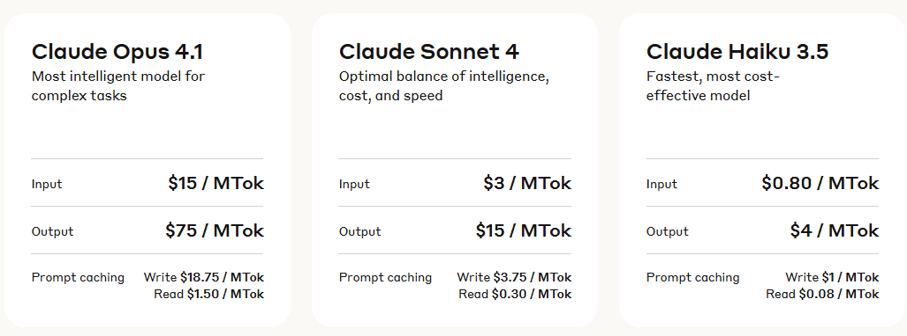

### Vibe coding: magia para el usuario, problemas para las startups

Una de las cosas que han conseguido, entre comillas, los LLMs es acercar la programación a usuarios que no saben programar.  
Hoy ya no es necesario —de nuevo entre comillas— conocer lenguajes para crear algo sencillo: basta con dar instrucciones en lenguaje natural y dejar que el modelo haga su magia.  
A esto se le llama *vibe coding*. Existen startups dedicadas a ello, como **Windsurf** o **Anysphere**, la matriz de **Cursor**.  

El problema es que las cuentas no salen.

---

### Cómo funciona

Plataformas como **Cursor**, **Windsurf** o **Replit** se han hecho famosas gracias al vibe coding.  
Básicamente venden acceso a una plataforma que, por debajo, depende de los modelos de grandes tecnológicas.  

**Anysphere** cobra a los usuarios por Cursor, pero paga a **Google**, **Anthropic** y **OpenAI** por acceder a **Gemini**, **Claude** y **GPT**.  

El negocio es frágil: los costes dependen de terceros, y los mejores modelos son cada vez más caros.  
Los usuarios quieren resultados de calidad, pero eso implica usar modelos premium… y la factura sube.  
El dilema: ofrecer lo mejor sin subir precios y, al mismo tiempo, competir contra los propios dueños de esos modelos, que también tienen sus plataformas.  

---

### La fragilidad del modelo

Cuando tu producto depende por completo de proveedores externos, cualquier cambio en sus tarifas puede dejarte fuera del juego.  
Es lo que pasó con **Windsurf**, valorada en 3.000 millones, pero con márgenes brutos muy negativos según *TechCrunch*.  

Hoy toda una industria vive de la esperanza de que los precios bajen, pero la realidad va en la dirección contraria.  

### Precios de referencia
Partiendo de que un millón de tokens equivale a unas 750.000 palabras (más que *El Señor de los Anillos* completo):  

- **Opus 4.1 (Anthropic):** 15 / 75 dólares por millón de tokens (input / output). Caro, pero muy utilizado en programación.  
- **Gemini 2.5 Pro (Google):** 1,25 / 10 dólares por millón de tokens.  
- **GPT-5 (OpenAI):** 1,25 / 10 dólares por millón de tokens. Mucho más barato que **GPT-4.1**, que costaba 3 / 12.  

Con un plan de **20 dólares al mes**, es probable que cada usuario cueste más de lo que paga.  
Prueba de ello es el cambio de precios de **Cursor Pro**: desde junio, ya no ofrece 500 respuestas rápidas con modelos premium, sino facturación directa según consumo de API.  

---

### Opciones para las startups

**1. Desarrollar sus propios modelos**  
Difícil, caro y lento, pero a largo plazo reduce costes.  
En esa dirección, **Anysphere** ya trabaja en *Fusion*, su propio LLM para programación.  

**2. Apostar a que los precios bajen**  
Algo que, salvo la excepción de **GPT-5**, no está ocurriendo.  
**Gemini 2.5 Pro** y **Claude 4.1** son más caros que sus antecesores.  

---

### Conclusión

Cuando tu negocio depende por completo de terceros, no controlas nada.  
La industria del vibe coding se apoya en la promesa de que los costes de IA se abaratarán, pero de momento la tendencia apunta en la dirección contraria.  
El riesgo para estas startups es claro: **si no controlas tu modelo, no controlas tu negocio**.
